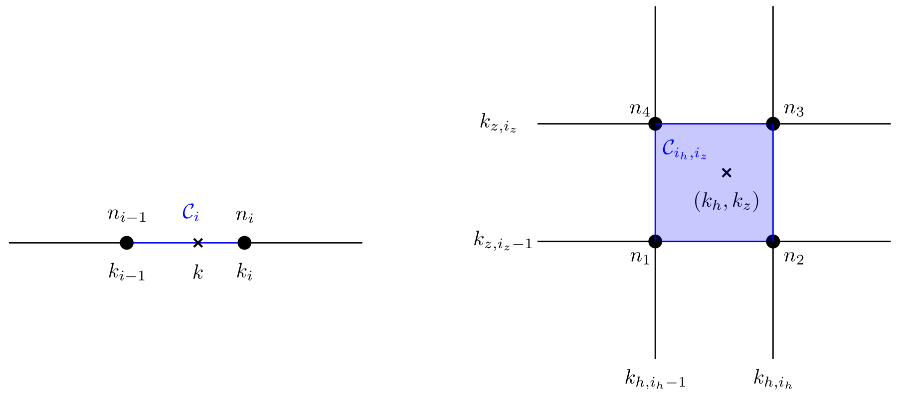

# Numerical methods

## Grid

Here are the methods used to create grids and compute related quantities.

```@autodocs
Modules = [WavKinS]
Order   = [:type,:function]
Pages   = ["src/grid/WavKinS_grid.jl"]
```

## Interpolation 

In the following figure, we represent a mesh of the wave vector grid for 1D systems (left) and 2D systems (right) problem.



For 1D systems, the ``i^{\rm th}`` mesh is ``\mathcal{C}_i \equiv [k_{i-1}: k_{i}]`` except for the first mesh which correspond to the segment ``\mathcal{C}_1 = [0:k_1]``. We extend this definition to 2D systems as ``\mathcal{C}_{i_h,i_z} \equiv [k_{h,i_h-1}: k_{h,i_h}] \times [k_{z,i_z-1}: k_{z,i_z}]``.

Inside each mesh, we use a given mathematical expression for interpolating the waveaction at ``k`` (or ``(k_h,k_z)``) knowing the value of the waveaction ``n_{i-1} = n(k_{i-1})`` and ``n_i = n(k_i)`` (or ``n_1 = n(k_{h,i_h-1}, k_{z,i_z-1})``, ``n_2 = n(k_{h,i_h}, k_{z,i_z-1})``, ``n_3 = n(k_{h,i_h}, k_{z,i_z})`` and ``n_4 = n(k_{h,i_h-1}, k_{z,i_z})``). This mathematical expression depends on the interpolation method.

!!! example 
    For using the linear interpolation method `lin_interp` with the [`Acoustic2D`](@ref) solver, you define the simulation strucure `Run` as `Run = Acoustic2D(Nk; interp_scheeme=WavKinS.lin_interp)`.

For each interpolation method, we store interpolation coefficients in stuctures that are defined in `src/interpolation/WavKinS_interpolation_structs.jl`. We compute these coefficients using the [`update_coeff_interp!`](@ref) method (one definition per interpolation method). Once the coefficients have been updated, you can compute the value of the waveaction at point ``k`` (or ``(k_h,k_z)``) using the method [`val_nk`](@ref). 

!!! note
    [`val_nk`](@ref) is overloaded to allow changing the interpolation scheme without changing anything in the solvers. For more informations about the interpolations methods, please refer to [`update_coeff_interp!`](@ref) documentation.

```@autodocs
Modules = [WavKinS]
Order   = [:type, :function]
Pages   = ["src/interpolation/WavKinS_interpolation_structs.jl", "src/interpolation/WavKinS_interpolation.jl"]
```

## Integration

Like for ["interpolation"](@ref "Interpolation"), you can choose an integration method (independently). Integration are performed by summing over meshes using the [`integrate`](@ref) method (one definition per interpolation method).  

!!! example 
    For using the integration method `integrate_with_log_bins` to integrate `Nk.nk` over meshes `imin` to `imax`, you use `integrate(integrate_with_log_bins, Nk, imin, imax)`. Note that `integrate(integrate_with_log_bins, Nk, i, i)` return the integral over mesh `i` only (i.e. between ``k_{i-1}`` and ``k_i``).

!!! note
    [`integrate`](@ref) is overloaded to allow changing the integration scheme without changing anything in the solvers. For more informations about the integrations methods, please refer to [`integrate`](@ref) documentation.

```@autodocs
Modules = [WavKinS]
Order   = [:type, :function]
Pages   = ["src/integration/WavKinS_integration_structs.jl", "src/integration/WavKinS_integration.jl"]
```

## Time-stepping

You can choose between several time stepping methods. Time advancement is done with the [`advance!`](@ref) method (one definition per time-stepping method).  

!!! example 
    For using the time stepping method `ETD4_step` to advance time of `dt`, you use `advance!(ETD4_step, Run, dt)`. 

!!! note
    [`advance!`](@ref) is overloaded to allow changing the time stepping scheme without changing anything in the solvers. For more informations about the integrations methods, please refer to [`advance!`](@ref) documentation.

```@autodocs
Modules = [WavKinS]
Order   = [:type, :function]
Pages   = ["src/time_stepping/WavKinS_time_stepping_structs.jl", "src/time_stepping/WavKinS_time_stepping.jl"]
```

## Miscellaneous

Unclassified numerical methods.

```@autodocs
Modules = [WavKinS]
Order   = [:type, :function]
Pages   = ["src/misc/WavKinS_misc.jl"]
```