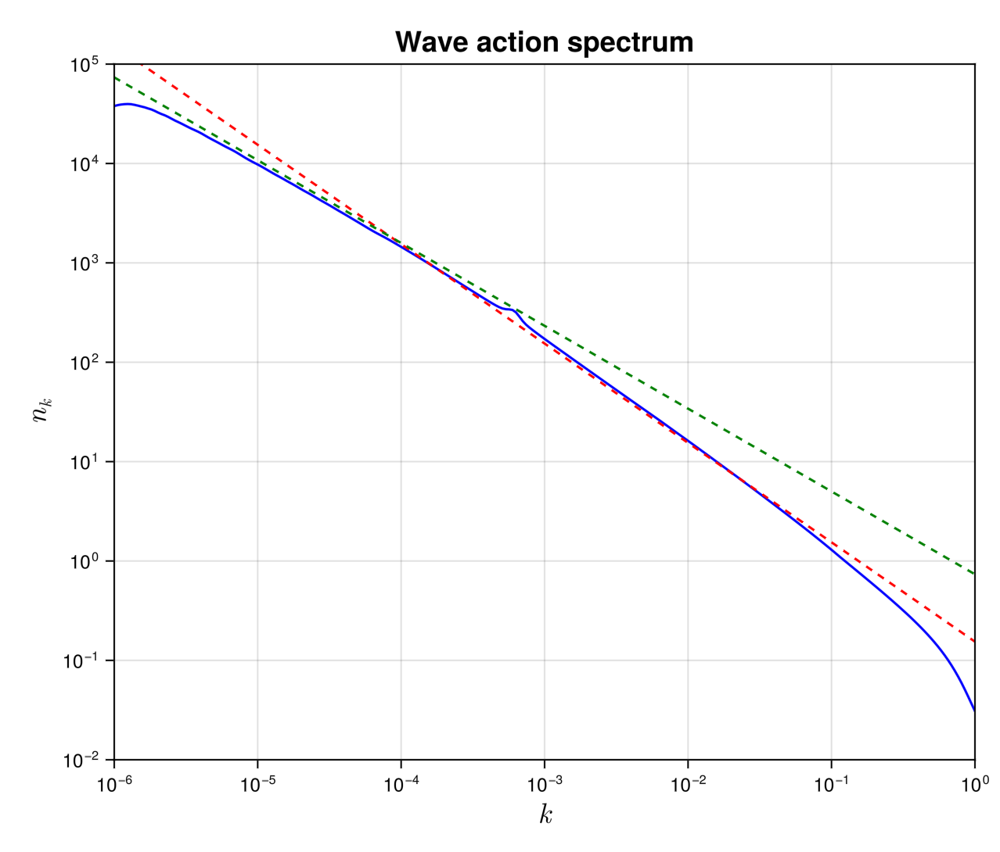

## MMT solver

The Majda-McLaughlin-Tabak (MMT) [Majda *et al.*, J. Nonliear Science. Vol. 7, 9–44, (1997)](http://link.springer.com/10.1007/BF02679124) model was introduced by the authors as a simple and numerically affordable model to test the theory of wave turbulence. It consists on one-dimensional partial differential equation where the dispersion relation and the homogeneity degree of the non-linearity are tunable parameters. This model has triggered enormous research and opened the way to the study of solitonic turbulence. It is still the matter of recent academic research. For a complete review see [Zakharov *et al.*, Physics Report. Vol. 398, Issue 1, (2004)](https://journals.aps.org/prl/abstract/10.1103/PhysRevLett.128.224501).


### Description

In the solver, we consider the WKE of the $1D$-MMT model $\dot{n_k}=St_k$ that explicitly reads
```math

\dot{n_k}=4\pi \int\left| T^{k1}_{23}\right|^2\delta(k+k_1-k_2-k_3)\delta(\omega^{k1}_{23})n_kn_1n_2n_3\left(\frac{1}{n_k}+\frac{1}{n_1}-\frac{1}{n_2}-\frac{1}{n_3}   \right)dk_1dk_2dk_3, 
```

where $\omega^{k1}_{23}=\omega_k+\omega_1-\omega_2-\omega_3$. More explicitly, for the  MMT model we have
```math
    \omega_k=|k|^\alpha, \quad T^{k1}_{23}=|k k_1 k_2 k_3|^{\beta/4}.
```
The solver only consider the case α=1/2 for which we can provide an analytical paremetrisation of the resonant manifold (given below)
```math
k+k_1-k_2-k_3 = 0,\quad
\omega_k+\omega_1-\omega_2-\omega_3 = 0
```

This wave kinetic equation conserves the total energy $H$ and waveaction $N$

```math
N= \int_{-\infty}^\infty n_kdk, \quad {\rm and }\quad H = \int_{-\infty}^\infty \omega_k n_kdk.
```

### Solver

#### The reduced truncated MMT wave kinetic equation
WavKinS solves the MMT wave kinetic equation making use of the two δ-Dirac. More precisely, it solves the following kinetic equation

```math
\dot{n_k}=4\pi \int_{-\infty}^\infty\frac{\left| \tilde{T}^{k1}_{23}\right|^2}{\Delta_{12}}n_kn_1n_2n_3\left(\frac{1}{n_k}+\frac{1}{n_1}-\frac{1}{n_2}-\frac{1}{n_3}   \right)dk_3,
```

where $\Delta_{12}=\frac{1}{2}\left| \frac{sign{(k_2)}}{\sqrt{k_2}}- \frac{sign{(k_1)}}{\sqrt{k_1}}  \right|$, $k_2=k+k_1(k_3)-k_3$ and $k_1(k_3)=k\, q_1(\frac{k_3}{k})$, with


```math
q_1(q_3) = \left\{
        \begin{array}{ll}
            -\frac{\left(q_3+\sqrt{-q_3}-1\right)^2}{\left(\sqrt{-q_3}-1\right)^2} & \quad q_3 \leq -1 \\
            \frac{q_3 \left(q_3-2 \sqrt{-q_3}-1\right)}{(q_3+1)^2} & \quad -1 \leq q_3 \leq 0\\
            \frac{1}{2} \left(\sqrt{8 q_3^{3/2}-3 q_3^2-6 q_3+1}+q_3-1\right) & \quad 0 \leq q_3 \leq 1\\
            \frac{1}{2} \left(\sqrt{q_3^2-6 q_3+8 \sqrt{q_3}-3}+q_3-1\right) & \quad 1 \leq q_3\\
        \end{array}
    \right.
```


The modified collisional matrix is simply $\tilde{T}^{k1}_{23}=\theta_k\theta_1\theta_2\theta_3 \tilde{T}^{k1}_{23}$, where $\theta_k = 1$ if $|k|\le k_{\rm max}$, and $0$ otherwise, with $k_{\rm max}$ the maximum wavenumber. This truncated WKE, exactly conserves the truncated invariants 
```math
N= \int_{|k|<k_{\rm max}} n_kdk, \quad {\rm and }\quad H = \int_{|k|<k_{\rm max}} \omega_k n_kdk.
```
We use logarithmic grid [`wave_spectrum`](@ref) to represent the waveaction spectrum $n_k$. The integral in the collisional is computed first for $k_3<0$, assuming $n_k=n_{-k}$, and then for $k>0$. There are no singular terms to take care of. 

Note the if we use $M$ nodes to simulate the MMT model, then the numerical cost is of the order of $M^2$ operations.

#### Using the MMT solver

As all the other WavKinS solvers, for MMT we need to create a `MMT` structure containing all the fields, working space, diagnostics, etc.  

```julia
using WavKinS

# Create a waveaction structure containing the basic grid
M = 256 # set the number of nodes
kmin = 1e-6 # minimal wave number
kmax = 1e0 # maximal wave number
Nk = wave_spectrum(kmin,kmax,M)

# Creating a MMT run structure with default parameters and β = 0.
Run = MMT(Nk; β=0.0);
```
The MMT solver has implemented an option to compute the collisional term as a sink and a source term
```math
St_{\bf k} = -\gamma_{\bf k} n_{\bf k} + \eta_{\bf k}
```
The computation of ``γ`` and ``η`` are performed with the options `compute_γk` and `compute_ηk` and accesible as:    

```julia
# computing collisional integral
St_k!(Run;compute_Sk=true, compute_γk=true, compute_ηk=true)
γ_k = Run.γk
η_k = Run.ηk    
```
If both, `compute_γk=false` and `compute_ηk=false`, then ``St_k`` is computed directly.


!!! warning 
    The MMT solver is compatible with the time stepping `AB_Euler_step` and `AB2_RK2_step`, but still under testing. 


#### Diagnostics

In addition to the standard diagnostics, the solver computes the waveaction flux spectrum.

```math
Q_k = -2\int_0^k St_q dq
```

Spectral and global quantities can be directly computed using the provided routines (see  [`this tutorial`](@ref "Defining a new diagnostic")). It is stored in 
```julia
  Run.diags.sp_outs["Qk"] # for I/0 purposes
  Run.diags.sp_store["Qk"] # stored over time
```


#### Testing convergence of the collisional integral

WavKinS provide a simple test of the numerical convergence of the computation of the collisional integral. The testing script is located in `/run/tests/physical_systems/tests_MMT.jl`. 

Theoretically, the collisional integral should conserve the waveaction and the energy, which means that

```math
\int_{-\infty}^\infty St_k dk=0, \quad \int_{-\infty}^\infty \omega_k St_k dk=0.
```
The following numerical test evaluates those integrals and check the convergence to $0$.

```julia
using WavKinS

function nk_test(kx)
    return exp(-abs(kx)) * kx^2
end

for M ∈ 2 .^ (4:10)
    kmin = 1e-3
    kmax = 1e+2

    Nk = wave_spectrum(kmin,kmax,M)
    Run = WavKinS.MMT(Nk; interp_scheeme=WavKinS.lin_interp);

    kk = Nk.kk
    @. Nk.nk = nk_test.(kk)

    WavKinS.St_k!(Run;compute_Sk=true, compute_γk=true, compute_ηk=true)
    
    Flux = wave_spectrum(kmin,kmax,M)
    @. Flux.nk =  Run.Sk.nk
    NFlux= integrate_with_log_bins(Flux)
    
    @. Flux.nk = Run.ω(kk) * Run.Sk.nk
    EFlux= integrate_with_log_bins(Flux)

    AA = total_waveaction(Run)
    Ene = energy(Run)

    println("M = ", M, ", Integral flux num: dN/N=", NFlux/AA, " dH/H=", EFlux/Ene)

end
```
The output of this test is 

```
M = 16, Integral flux num: dN/N=-3.067434124891184e-11 dH/H=1.5573442892100724
M = 32, Integral flux num: dN/N=-2.395977091429804e-11 dH/H=0.1108223756248543
M = 64, Integral flux num: dN/N=-2.069127127113921e-11 dH/H=0.03449846831998508
M = 128, Integral flux num: dN/N=3.257316662210291e-10 dH/H=0.007241206687316066
M = 256, Integral flux num: dN/N=6.161729620725928e-8 dH/H=0.0019066862575089908
M = 512, Integral flux num: dN/N=1.2749063308649134e-9 dH/H=0.000501465301534334
M = 1024, Integral flux num: dN/N=-2.3447541840433413e-10 dH/H=0.0001278778185124224
```

The solver conserves well the waveaction and errors on energy conservation roughly decreases as $M^{-2}$.

### Theoretical predictions

As usual in wave turbulence theory, there is a number of theoretical predictions for the MMT model. In the case of out-of-equilibrium solutions, with forcing and dissipation, the theoretical predictions are 
```math
n_k=C_{KZ}^Q |Q_0|^{1/3}k^{-x_Q},\quad n_k=C_{KZ}^P P_0^{1/3}k^{-x_P}
```
where $Q_0$ and $P_0$ are the waveaction and energy fluxes, and the superscript $Q$ and $P$ denotes the inverse waveaction and direct energy cascades, respectively. The theory predicts [Zakharov *et al.*, Physics Report. Vol. 398, Issue 1, (2004)](https://journals.aps.org/prl/abstract/10.1103/PhysRevLett.128.224501) 
```math
x_Q =1+( 2\beta-\alpha)/3  ,\quad x_P=1+2\beta/3
```

The constants $C_{KZ}^Q=(3/(8\pi |I'(x_Q)|))^{1/3}$ and $C_{KZ}^P=(3/(8\pi I'(x_P)))^{1/3}$, with $I(x)$ the dimensionless collisional integral, can be also computed numerically. WavKinS also provides routines to compute the derivatives of $I(x)$ with $\alpha=1/2$. They can be accessed as

```julia
β = Run.β;
α = 1.0 / 2.0;
xQ = 2 * β / 3 + 1 - α / 3;
xP = 2 * β / 3 + 1;
WavKinS.dxI_MMT(xP)
WavKinS.dxI_MMT(xQ)
```
which produces the output 
```
-2.354496680354443
6.061632815153047
```
Note that $I'(x_Q)<0$ and $I'(x_P)>0$, consistently with the expected inverse and direct cascade for waveaction and energy, respectively.


#### Running the MMT solver

WavKinS provides a ready to use script to obtain out-of-equilibrium steady states of the WKE. The script is similar to the one presented in the tutorial and can be found in `/run/simple/RunSimpleEvolution_MMT.jl`. Running the script will generate the following plot


The dashed lines are the theoretical predictions for the inverse waveaction (green) and direct energy (blue) cascades, with no adjustable parameters.


!!! info 
    The previous plot took less than 30 seconds on a 3 GHz 10-Core Intel Xeon W iMac Pro, using 4 cores. 

### List of structures and methods for MMT solver
```@autodocs
Modules = [WavKinS]
Order   = [:type, :function]
Pages   = ["src/physical_systems/MMT/basics.jl", "src/physical_systems/MMT/structure.jl", "src/physical_systems/MMT/collision_integral.jl","src/physical_systems/MMT/diagnostics.jl"]
```
