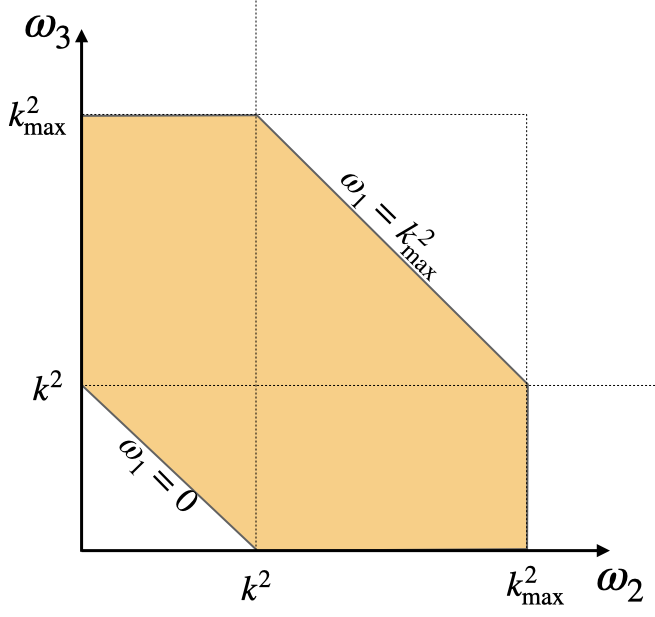
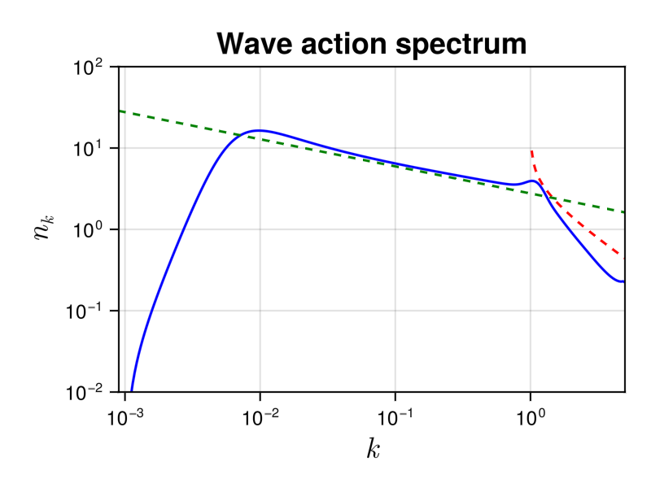

## NLS3Dsolver

The nonlinear Schrodinger (NLS) equation is one of the most important model in physics. It applications vary from nonlinear optics, water waves to Bose-Einsteing condensates. The equation is also known as the Gross-Pitaevskii equation, a fundamental equation describing superfluids.

### Description

In the solver, we consider the WKE of the $3D$-NLS model $\dot{n_k}=St_k$ that explicitly reads
```math

\dot{n_k}=4\pi \int \delta({\bf k+k_1-k_2-k_3})\delta(\omega^{k1}_{23})n_kn_1n_2n_3\left(\frac{1}{n_{\bf k}}+\frac{1}{n_{\bf 1}}-\frac{1}{n_{\bf 2}}-\frac{1}{n_{\bf 3}}   \right)d{\bf k_1}d{\bf k_2}d{\bf k_3}, 
```

where $\omega^{k1}_{23}=\omega_k+\omega_1-\omega_2-\omega_3$, with $\omega_k = k^2$. Note that in the general case, there are $3\times3 -3 -1=5$ integrals to be performed for each element of in wavevector space. Solving this equation will then require $M^8$ operation per time-step, where $M$ is the number of discretization points of the wavevector space in each direction. Such an enormous cost makes the simulation numerically unfeasible. In WavKinS, we assume isotropy and consider the isotropic kinetic equation which drastically reduces the number of computations.

This wave kinetic equation conserves the total energy $H$ and waveaction $N$

```math
N= \int  n_{\bf k}d{\bf k}, \quad {\rm and }\quad H = \int \omega_{\bf k} n_{\bf k}d{\bf k}.
```


### Solver

#### The reduced isotropic NLS wave kinetic equation

WavKinS solves the isotropic 3DNLS wave kinetic equation (see [Zhu *et al.*, Phys. Rev. E 106, 014205 (2022)](https://journals.aps.org/pre/abstract/10.1103/PhysRevE.106.014205) for a recent derivation and revision of prefactors). After angle average, the collisional integral simplifies considerable and reduces to a bi-dimensional integral. In WavKinS, the collisional integral is computed after performing a change of variable to $\omega=k^2$. The isotropic NLS3D WKE is

```math
\dot{n_k}=\frac{4\pi^3}{k} \int \mathcal{S}^{k1}_{23}\delta(\omega^{k1}_{23})\, n_kn_1n_2n_3\left(\frac{1}{n_k}+\frac{1}{n_1}-\frac{1}{n_2}-\frac{1}{n_3}   \right)d\omega_1d\omega_2d\omega_3,
```
with $\mathcal{S}^{k1}_{23}=\theta_k\theta_1\theta_2\theta_3 \min{[k,\sqrt{\omega_1},\sqrt{\omega_2},\sqrt{\omega_3}]}$ and $\theta_k = 1$ if $|k|\le k_{\rm max}$, and $0$ otherwise, with $k_{\rm max}$ the maximum wavenumber. Note that the integration over the resonant manifold is simply given by replacing $\omega_1=\omega_2+\omega_3-\omega_k$.

This truncated WKE, exactly conserves the truncated invariants [Zhu *et al.*, Phys. Rev. E 108, 064207 (2023)](https://journals.aps.org/pre/abstract/10.1103/PhysRevE.108.064207)
```math
N=  4\pi \int_0^{k_{\rm max}} n_kk^2dk, \quad {\rm and }\quad H = 4\pi \int_0^{k_{\rm max}} \omega_k n_kk^2dk.
```

Note that the numerical cost is now reduced to $M^3$.

#### Numerical method

Due to the truncation term $\theta_1\theta_2\theta_3$ the integration domain of the WKE is bounded and reduced to the following domain

```math
0\le\omega_1,\omega_2,\omega_3\le k_{\rm max}^2,
```
which correspond to the coloured area in the figure.



We use logarithmic grid [`wave_spectrum`](@ref) to represent the waveaction spectrum $n_k$. The integrals in the collisional term are also computed [`wave_spectrum`](@ref) structures supported on $(0,k_{\rm max}^2]$, and taking care of the boundaries of the domain that can be out of grid. There are no singular terms to take care of. 

The different options are described in the [`NLS3D`](@ref) documentation.

#### Using the NLS3D solver

As all the other WavKinS solvers, for NLS3D we need to create a [`NLS3D`](@ref) structure containing all the fields, working space, diagnostics, etc.  

```julia
using WavKinS

# Create a waveaction structure containing the basic grid
M = 256 # set the number of nodes
kmin = .9e-3 # minimal wave number
kmax = 5e+0 # maximal wave number
Nk = wave_spectrum(kmin, kmax, M)

# Creating a NLS3D run structure with default parameters.
Run = WavKinS.NLS3D(Nk);
```
The NLS3D solver has implemented an option to compute the collisional term as a sink and a source term
```math
St_{\bf k} = -\gamma_{\bf k} n_{\bf k} + \eta_{\bf k}
```
The computation of ``γ`` and ``η`` are performed with the options `compute_γk` and `compute_ηk` and accesible as:    

```julia
# computing collisional integral
St_k!(Run;compute_Sk=true, compute_γk=true, compute_ηk=true)
γ_k = Run.γk
η_k = Run.ηk    
```
If both, `compute_γk=false` and `compute_ηk=false`, then ``St_k`` is computed directly.


!!! warning 
    The NLS3D solver is compatible with the time stepping `AB_Euler_step` and `AB2_RK2_step`, but still under testing. 


#### Diagnostics

In addition to the standard diagnostics, the solver computes the waveaction flux spectrum.

```math
Q_k = -4\pi\int_0^k St_q q^2dq
```

Spectral and global quantities can be directly computed using the provided routines (see  [`this tutorial`](@ref "Defining a new diagnostic")). It is stored in 
```julia
  Run.diags.sp_outs["Qk"] # for I/0 purposes
  Run.diags.sp_store["Qk"] # stored over time
```


#### Testing convergence of the collisional integral

WavKinS provide a simple test of the numerical convergence of the computation of the collisional integral. The testing script is located in `/run/tests/physical_systems/tests_NLS3D.jl`. 

Theoretically, the collisional integral should conserve the waveaction and the energy, which means that

```math
\int_0^{k_{\rm max}} St_k k^2 dk=0, \quad \int_0^{k_{\rm max}} \omega_k St_k k^2dk=0.
```
The following numerical test evaluates those integrals and check the convergence to $0$.

```julia
using WavKinS

function nk_test(kx)
    return exp(-abs(kx)^2) * kx^2
end

println("---------------------------------------------------------------------")
println("Testing collisional integral")
println("")

for M ∈ 2 .^ (4:9)
    kmin = 1e-2
    kmax = 1e+1

    Nk = wave_spectrum(kmin, kmax, M)
    Run = WavKinS.NLS3D(Nk)

    kk = Nk.kk
    @. Nk.nk = nk_test.(kk)

    WavKinS.St_k!(Run; compute_Sk=true, compute_γk=false, compute_ηk=false)

    Flux = wave_spectrum(kmin, kmax, M)
    @. Flux.nk = kk^4 * Run.Sk.nk
    FluxNumH = integrate_with_log_bins(Flux)

    @. Flux.nk = kk^2 * Run.Sk.nk
    FluxNumN = integrate_with_log_bins(Flux)

    AA = total_waveaction(Run)
    Ene = energy(Run)

    println("M in k= ", M, ", Integral flux num: dN/n=", FluxNumN / AA, " dH/H=", FluxNumH / Ene)
end

println("")
println("---------------------------------------------------------------------")
```
The output of this test is 

```
---------------------------------------------------------------------
Testing collisional integral

M in k= 16, Integral flux num: dN/n=-1.1921326630233626 dH/H=-1.4541383004395845
M in k= 32, Integral flux num: dN/n=-0.44858827560085296 dH/H=-0.550829241400805
M in k= 64, Integral flux num: dN/n=-0.13109042503536641 dH/H=-0.169719084207455
M in k= 128, Integral flux num: dN/n=-0.03668301242101203 dH/H=-0.04868205790683482
M in k= 256, Integral flux num: dN/n=-0.009695220531387884 dH/H=-0.012918492831232576
M in k= 512, Integral flux num: dN/n=-0.0026314061815940525 dH/H=-0.003391676130269483

---------------------------------------------------------------------
```

The solver conserves well the waveaction and errors on energy conservation roughly decreases as $M^{-2}$.


### Theoretical predictions

The wave turbulence theory provides analytical prediction for out-of-equilibrium steady states obtained with forcing and dissipation. The theory predict a inverse cascade of waveaction and a direct cascade of energy. The corresponding theoretical prediction are (see [Zhu *et al.*, Phys. Rev. Lett. 130, 133001 (2023)](https://journals.aps.org/prl/abstract/10.1103/PhysRevLett.130.133001) :
```math
n_k=C_{KZ}^Q |Q_0|^{1/3}k^{-7/3},\quad n_k=C_{KZ}^P P_0^{1/3}k^{-3}\ln^{-1/3}{(k/k_f)}
```
where $Q_0$ and $P_0$ are the waveaction and energy fluxes, and the superscript $Q$ and $P$ denotes the inverse waveaction and direct energy cascades, respectively. Here, $k_f$ denotes the forcing scale appearing due to non-locality of the direct energy cascade. The theory also predicts the values of the dimensionless constants
```math
C_{KZ}^Q =7.577\times 10^{-2}  ,\quad C_{KZ}^P=5.26\times 10^{-2} 
```


#### Running the NLS3D solver

WavKinS provides a ready to use script to obtain out-of-equilibrium steady states of the WKE. The script is similar to the one presented in the tutorial and can be found in `/run/simple/RunSimpleEvolution_NLS3D.jl`. Running the script will generate the following plot exhibiting the steady state inverse waveaction cascade


The dashed lines are the theoretical predictions for the inverse waveaction (green) and direct energy (red) cascades, with no adjustable parameters.


!!! info 
    The previous plot took 290 seconds on a 3 GHz 10-Core Intel Xeon W iMac Pro, using 4 cores. 


### List of structures and methods for NLS solvers
```@autodocs
Modules = [WavKinS]
Order   = [:type, :function]
Pages   = ["src/physical_systems/NLS3D/basics.jl", "src/physical_systems/NLS3D/structure.jl", "src/physical_systems/NLS3D/collision_integral.jl","src/physical_systems/NLS3D/diagnostics.jl"]
```