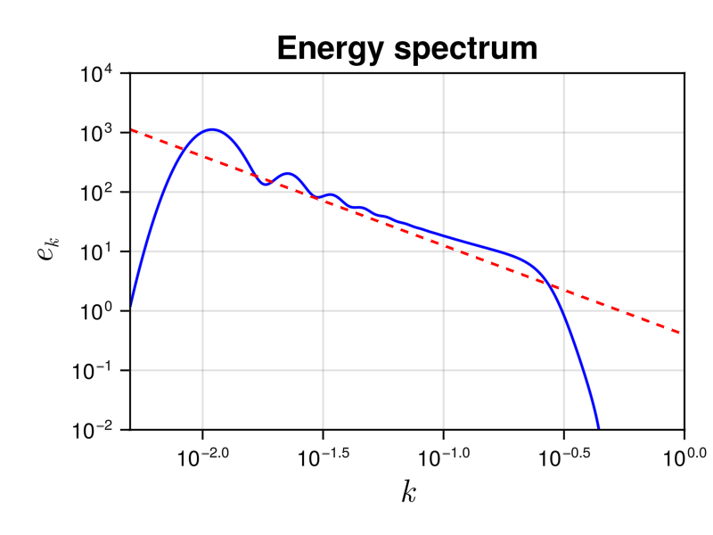

## Smoluchowskisolver

The Smoluchowski equation is a standard model of statistical physics. It describes coagulation processes such as droplets in clouds, blood clots, meteorite formation from stellar dust, and so on.

### Description

In this case we use $k$ for the particle mass and $n_{k}$ is the particle density. The collision integral is 

```math
St_{k} = \frac{1}{2} \int\limits_0^k ~ K(k-p,p) ~ n(k-p,t) ~ n(p,t) ~ \mathrm{d}p -\int\limits_0^\infty ~ K(k,p) ~ n(k,t) ~ n(p,t) ~ \mathrm{d}p.
```

The coagulation kernel $K(k,p)$ describes the rate at which particles of mass $k$ coagulate with particles of mass $p$. The constant, additive, and multiplicative kernels are defined as
    
$$K(k,p) = 1, ~~~~ K(k,p) = k + p, ~~~~ K(k,p) = k p$$

respectively. These kernels are defined in `src/physical_systems/Smoluchowski/basics.jl`. Using other kernels is easy since $K$ is passed as an element of the [`Smoluchowski`](@ref) structure. For more information about the Smoluchowski equation, you can refer to [wikipedia](https://en.wikipedia.org/wiki/Smoluchowski_coagulation_equation).

Note that in the general case, there is only $1$ integral to perform for each element of in mass space. Solving this equation will then require $M^2$ operation per time-step, where $M$ is the number of discretization points of the mass space. It makes the simulation relatively cheap.

This wave kinetic equation conserves the total mass $H$

```math
H = \int k n_{\bf k} d{\bf k}.
```


### Solver

#### Numerical method

The computation of the collision integral $St_{k}$ is straightforward. We use logarithmic grid [`wave_spectrum`](@ref). 

The different options are described in the [`Smoluchowski`](@ref) documentation.

#### Using the Smoluchowski solver

As all the other WavKinS solvers, for Smoluchowski we need to create a [`Smoluchowski`](@ref) structure containing all the fields, working space, diagnostics, etc.  

```julia
using WavKinS

# Create a waveaction structure containing the basic grid
M = 1024 # set the number of nodes
kmin = 5e-3 # minimal wave number
kmax = 1e0 # maximal wave number
Nk = wave_spectrum(kmin, kmax, M)

# Creating a NLS3D run structure with default parameters and multiplicative kernel.
Run = Smoluchowski(Nk; K=WavKinS.K_Smoluchowski_multiplicative)
```
Note that the constructor allows to define the coagulation kernel in the structure so it is easy to use this solver to study many different physical systems. For example, you can investigate systems with kernels of the form $K(k,p) = (k p)^{1/3}$ by using

```julia
function K_spec(k,p)
    return (k*p)^(1/3)
end

Run = Smoluchowski(Nk; K=K_spec)
```


#### Diagnostics

This solver has the standard diagnostics.

!!! warning 
    For consistency with other systems, we fix the "wave frequency" to the particle mass, i.e. $\omega_{k} = k$. In that way, you can use basic diagnostics as for other solvers, but with a different meaning. For example, the "energy" [`energy`](@ref) is the total mass of particles and the "energy flux" [`energy_flux!`](@ref) is the mass flux.

#### Testing convergence of the collisional integral

WavKinS provide a simple test of the numerical convergence of the computation of the collisional integral. The testing script is located in `/run/tests/physical_systems/tests_Smoluchowski.jl`. 

Theoretically, the collisional integral should conserve the mass, which means that

```math
\int_0^{k_{\rm max}} St_k k dk=0.
```
The following numerical test evaluates those integrals and check the convergence to $0$.

```julia
using WavKinS

function nk_test(kk)
    nk = kk^2 * exp(-kk / 50.0) / 250000
    return nk
end

println("---------------------------------------------------------------------")
println("Testing collisional integral")
println("")

for M ∈ 2 .^ (4:9)
    kmin = 5e-3
    kmax = 5e+3

    Nk = wave_spectrum(kmin,kmax,M);
    Run = Smoluchowski(Nk; K=WavKinS.K_Smoluchowski_one, interp_scheeme=WavKinS.lin_interp);

    kk = Nk.kk
    λ = Nk.λ
  
    @. Nk.nk = nk_test.(kk);

    WavKinS.St_k!(Run)
    
    Flux = wave_spectrum(kmin,kmax,M)
    @. Flux.nk = Run.Sk.nk .* Run.ω.(kk);
    FluxNumH = integrate(Flux)

    Ene = energy(Run)
    
    println("M in k= ", M, ", Integral flux num: dH/H=", FluxNumH / Ene)
end

println("")
println("---------------------------------------------------------------------")
```
The output of this test is 

```
---------------------------------------------------------------------
Testing collisional integral

M in k= 16, Integral flux num: dH/H=0.2848719543347318
M in k= 32, Integral flux num: dH/H=0.04709845613146857
M in k= 64, Integral flux num: dH/H=0.015286090880996035
M in k= 128, Integral flux num: dH/H=0.003651780879324013
M in k= 256, Integral flux num: dH/H=0.0009964865076014901
M in k= 512, Integral flux num: dH/H=0.0002502083115315172

---------------------------------------------------------------------
```

The solver conserves well the waveaction and errors on energy conservation roughly decreases as $M^{-2}$.


### Theoretical predictions

For kernel of the form $K(k,p) = a (kp)^{\xi/2}$, the wave turbulence theory provides analytical prediction for out-of-equilibrium steady states obtained with forcing and dissipation, associated to a direct cascade of mass. The corresponding theoretical prediction are (see [Connaughton *et al.*, Phys. Rev. E 69, 061114 (2004)](https://journals.aps.org/pre/abstract/10.1103/PhysRevE.69.061114) ):  
```math
n_k=C_{KZ}^P |P_0|^{1/2}k^{-(3+\xi)/2}
```
where $P_0$ is mass flux, and the superscript $P$ denotes the direct mass cascade. The theory also predicts the values of the dimensionless constant
```math
C_{KZ}^P=\frac{1}{\sqrt{2 \pi a}}.
```


#### Running the Smoluchowski solver

WavKinS provides a ready to use script to obtain out-of-equilibrium steady states of the WKE. The script is similar to the one presented in the tutorial and can be found in `/run/simple/RunSimpleEvolution_Smoluchowski.jl`. Running the script will generate the following plot exhibiting the steady state direct mass cascade. 


The dashed line is the theoretical prediction, with no adjustable parameters. The gelation process (see [Ball *et al.*, Phys. Rev. E 84, 011111 (2011)](https://journals.aps.org/pre/abstract/10.1103/PhysRevE.84.011111) ), corresponding to a non-local transfer of small mass to large mass, explains the spectral bump at large mass.


!!! info 
    The simulation took 39.1 seconds on a 2.30 GHz 8-Core 11th Gen Intel(R) Core(TM) i7-11800H, using 8 cores. 


### List of structures and methods for Smoluchowski solver
```@autodocs
Modules = [WavKinS]
Order   = [:type, :function]
Pages   = ["src/physical_systems/Smoluchowski/basics.jl", "src/physical_systems/Smoluchowski/structure.jl", "src/physical_systems/Smoluchowski/collision_integral.jl"]
```
