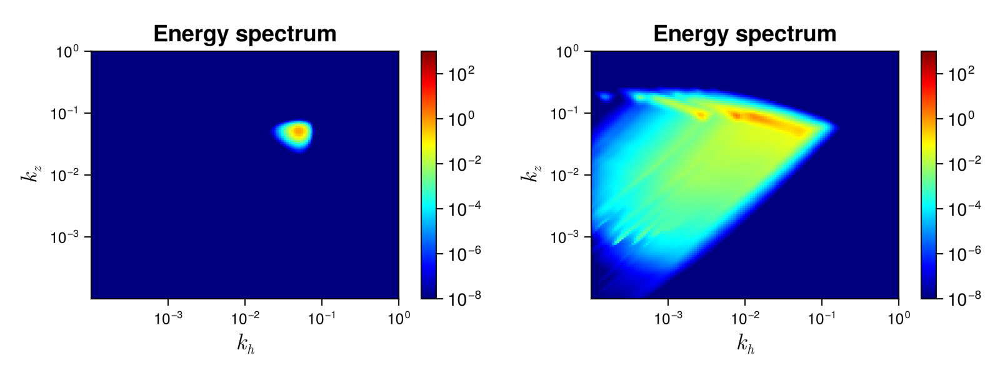

## Stratified_Asympsolver

Internal Gravity Waves (IGW) propagate in stratified flows like the oceans and atmospheres. They are therefore important for geophysical applications (see [Lvov *et al.*, J. Phys. Oceanogr. 42, 669–691 (2012)](https://doi.org/10.1175/2011JPO4129.1.) for a review). The [`Stratified_Asymp`](@ref) solver is for the kinetic equation of IGW in the strong anisotropy (or hydrostatic) limit, where we consider that the horizontal wave vector $k_h$ is small compared to the vertical wave vector $k_z$.   


### Description

In the solver, we consider the WKE of $3D$-internal waves $\dot{n_{\bf k}}=St_k$. We consider that $n_{\bf k}$ is isotropic in the plane perpendicular to the gravity (the $z$-axis), and therefore it is a function of the magnitude of the horizontal wavevector $k_h$ and the vertical wavavector $k_z$ only. It explicitly reads
```math
St_{{\bf k}} = 8 \pi ~ \int ~ \left[ \mathcal{R}^k_{12} - \mathcal{R}^1_{k2} - \mathcal{R}^2_{k1} \right] ~ k_{1h} k_{2h} ~ \mathrm{d} k_{1h} \mathrm{d} k_{2h}
```

where

```math
\mathcal{R}^k_{12} = \frac{|V_{k12}|^2}{|g'| \Delta} \left( n_1 n_2 - n_{\bf k} n_1 - n_{\bf k} n_2 \right),
```

the interaction coefficients are

```math
V_{k12} = \sqrt{\frac{k_h k_{1h} k_{2h}}{32}} \left( \frac{{\bf k}_h \cdot {\bf k}_{1h}}{k_h k_{1h}} \sqrt{\left| \frac{k_{2z}}{k_z k_{1z}} \right|} + \frac{{\bf k}_h \cdot {\bf k}_{2h}}{k_h k_{2h}} \sqrt{\left| \frac{k_{1z}}{k_z k_{2z}} \right|} + \frac{{\bf k}_{1h} \cdot {\bf k}_{2h}}{k_{1h} k_{2h}} \sqrt{\left| \frac{k_z}{k_{1z} k_{2z}} \right|} \right),
```

the determinant is

```math
\Delta = \frac{1}{2} \sqrt{(- k_h + k_{1h} + k_{2h}) (k_h - k_{1h} + k_{2h}) (k_h + k_{1h} - k_{2h}) (k_h + k_{1h} + k_{2h})},
```

and 

$$g' = \frac{k_{1h} {\rm sign}(k_{1z})}{k_{1z}^2} - \frac{k_{2h} ~ {\rm sign}(k_{2z})}{k_{2z}^2}.$$

This WKE results from assuming axisymmetry around the stratification axis ${\bf e}_{z}$. The dispersion relation is

```math
\omega_k=N k_h/|k_z|
```

with $N$ the buoyancy frequency. $k_{1z}$, $k_{2z}$ are given by the solution of the resonance conditions, i.e. the joint conservation of momentum and energy in each triadic interaction (${\bf k} = {\bf k}_1 + {\bf k}_2$ and $\omega_k = \omega_1 + \omega_2$ for $\mathcal{R}^k_{12}$ and so on). See [Lvov and Tabak, Phys. Rev. Lett. 87, 168501 (2001)](https://journals.aps.org/prl/abstract/10.1103/PhysRevLett.87.168501),  [Dematteis and Lvov, JFM 915, A129 (2021)](https://www.cambridge.org/core/journals/journal-of-fluid-mechanics/article/abs/downscale-energy-fluxes-in-scaleinvariant-oceanic-internal-wave-turbulence/575CD634A844D7DACF84EBBA9FF5A084) and [Labarre *et al.*, arXiv, 2407.11469 (2024)](https://arxiv.org/abs/2407.11469).

This wave kinetic equation conserves the total energy 

```math
H = \int \omega_{\bf k} n_{\bf k} d{\bf k}.
```

### Solver

#### Numerical method

We use the symmetry $k_1 \leftrightarrow k_2$ to write the collision integral as

$$St_{\bf k} = St(k_h,|k_z|) = 4 \pi \int ~ \frac{L(p,q)}{\Delta(p,q)} ~ \mathrm{d}p \mathrm{d}q$$

The integral is performed over the kinematic box $(p,q) \in [-k_h,k_h] \times [0,q_{\rm max}]$, $q_{\rm max}$ being a cut-off ($=2k_{h,{\rm max}}$ by default). the kinematic box depends on $k_h$ so you can change the number of grid points and cut-offs for each $k_h$. See [`kinematic_box`](@ref) for more details.

We use the method `L_vs` to compute the term

$$L(p,q) = \left. \frac{|V_{k12}|^2}{|g'|} \left( n_1 n_2 - n_{\bf k} n_1 - n_{\bf k} n_2 \right) k_{1h} k_{2h} \right|_{R_k} - 2 \left. \frac{|V_{k12}|^2}{|g'|} \left( n_1 n_2 - n_{\bf k} n_1 - n_{\bf k} n_2 \right) k_{1h} k_{2h} \right|_{R_1},$$

where we use the notation $R_k$ (respectively $R_1$) to indicate that the terms are evaluated on the resonant manifold ${\bf k} = {\bf k}_1 + {\bf k}_2$, $\omega_{\bf k} = \omega_1 + \omega_2$ (respectively ${\bf k}_1 = {\bf k} + {\bf k}_2$, $\omega_1 = \omega_{\bf k} + \omega_2$). For each case ($R_k$ or $R_1$), there are two branches, i.e. two solutions for $k_{1z}$ that coded in `k1zkp_vs`, `k1zkm_vs`, `k1z1p_vs` and `k1z1m_vs`.

The denominator

$$\Delta(p,q) = \frac{1}{2} \sqrt{(k_h^2-p^2) q (2 k_h+q)}$$

is zero at the borders of the kinematic box $p = \pm k_h$ and/or $q=0$, leading to integrable singularities that must be treated for accurate results.

For the contribution of the grid points with $q = 0$, we use

$$\int\limits_0^{\delta k_h} ~ \frac{L(p,q)}{\Delta(p,q)} ~ \mathrm{d}q \simeq L(p,\delta k_h) \sqrt{ \frac{2 \delta}{k_h^2-p^2}}$$

with $\delta \ll 1$.

For the contribution of the grid points with $p = -k_h$, we use 

$$\int\limits_{-k_h}^{(-1+\xi) k_h} ~ \frac{L(p,q)}{\Delta(p,q)} ~ \mathrm{d}p \simeq L((-1+\xi)k_h,q) \sqrt{\frac{2 \xi}{q(2k_h+q)}}$$ 

with $\xi \ll 1$. The contribution of grid points with $p = k_h$ is computed in the same way.

For the two grid points with $p = \pm k_h$ and $q=0$, we use

$$\int\limits_0^{\delta k_h} \int\limits_{\pm k_h}^{\pm(-1+\xi) k_h} ~ \frac{L(p,q)}{\Delta(p,q)} ~ \mathrm{d}p \mathrm{d}q \simeq  L(\pm(-1+\xi) k_h,\delta k_h) 2 \left( \pi - 2 \arcsin (1-\xi) \right) \arcsin \left( \sqrt{\delta/2} \right).$$ 

We use the logarithmic two-dimensional grid [`wave_spectrum_khkz`](@ref) to represent the waveaction spectrum $n_{\bf k}$. The different options are described in the [`Stratified_Asymp`](@ref) documentation.

Note the if we use $M$ nodes to represent each coordinate of the Fourier space, then, the numerical cost of computing the collisional integral is of the order of $M^4$ operations, which is prohibitive. Well resolved numerical simulations with this solver therefore requires clusters.


#### Using the Stratified_Asymp solver

As all the other WavKinS solvers, we need to create a [`Stratified_Asymp`](@ref) structure containing all the fields, working space, diagnostics, etc.  

```julia
using WavKinS

# Create a waveaction structure containing the basic grid
Mh = 16 # set the number of nodes for horizontal wave number
Mz = 16 # set the number of nodes for vertical wave number
khmin = 5e-3 # minimal horizontal wave number
khmax = 1e0 # maximal horizontal wave number
kzmin = 5e-3 # minimal vertical wave number
kzmax = 1e0 # maximal vertical wave number
Nk = wave_spectrum_khkz(khmin,khmax,Mh,kzmin,kzmax,Mz)

# Creating a Stratified_Asymp run structure with default parameters.
Run = WavKinS.Stratified_Asymp(Nk);
```


#### Diagnostics and special post-processing

The standard diagnostics should work for this system. 

In `src/physical_systems/Stratified/special.jl`, we also have implemented other methods to compute and plot spectra using other coordinates. 

The function [`compute_ωkz_spectrum`](@ref) computes the $(\omega_{\bf k},k\simeq |k_z|)$ spectrum, which is widely used in oceanographic studies ([Olbers *et al.*, J. Phys. Oceanogr. 50, 751-771 (2020)](https://journals.ametsoc.org/view/journals/phoc/50/3/jpo-d-19-0224.1.xml)).

The function [`compute_ξkz_spectrum`](@ref) computes the $(\xi_{\bf k}\equiv k_h/k_z^2,|k_z|)$ spectrum.  $\xi_{\bf k} \simeq \xi_1 \simeq \xi_2$ for Induced Diffusion interactions ([Lanchon and Cortet, Phys. Rev. Lett. 131, 264001 (2023)](https://link.aps.org/doi/10.1103/PhysRevLett.131.264001)), so the spectrum develops along iso-$\xi_{\bf k}$ lines.

We also have implemented functions for plotting these spectra.


#### Testing convergence of the collisional integral

WavKinS provide a simple test of the numerical convergence of the computation of the collisional integral. The testing script is located in `/run/tests/physical_systems/tests_Stratified_Asymp.jl`. 

Theoretically, the collisional integral should conserve the waveaction and the energy, which means that

```math
2 \times 2 \pi \int_0^{k_{h{\rm max}}} \int_0^{k_{z{\rm max}}}  \omega_{\bf k} St_{\bf k} k_h \mathrm{d}k_h \mathrm{d}k_z = 0.
```
The following numerical test evaluates those integrals and check the convergence to $0$.

```julia
using WavKinS

function nk_test(kh,kz)
    return abs(kz^2)*exp(-kh - abs(kz)) * kh^1.5/(1. + abs(kz))/118
end

println("---------------------------------------------------------------------")
println("Testing collisional integral")
println("")

for j = 3:7
    Mh = 2^j
    Mz = 2^j
    khmin = 1e-2
    khmax = 1e2
    kzmin = 1e-2
    kzmax = 1e2
 
    Nk = wave_spectrum_khkz(khmin,khmax,Mh,kzmin,kzmax,Mz)
    Run = Stratified_Asymp(Nk; interp_scheeme=WavKinS.bilin_interp_khkz, integ_scheeme=integrate_with_log_bins_khkz)

    kkh = Nk.kkh
    kkz = Nk.kkz
    kk = Nk.kk
    KKH = kkh .* ones(length(kkz))'
    KKZ = ones(length(kkh)) .* kkz'
    @. Nk.nk = nk_test.(KKH, KKZ);

    WavKinS.St_k!(Run)

    Flux = wave_spectrum_khkz(khmin,khmax,Mh,kzmin,kzmax,Mz)
    @. Flux.nk = Run.Sk.nk * Run.ω.(KKH, KKZ) * KKH * Run.dΩ;

    Ene = energy(Run)
    FluxNumH = total_density_flux(Run, Run.ω)    
    
    println("Mh = ", Mh, ", Mz = ", Mz, ", Integral flux num: dH/H=", FluxNumH / Ene)
end

println("")
println("---------------------------------------------------------------------")
```
The output of this test is 

```
---------------------------------------------------------------------
Testing collisional integral for energy conservation

Mh = 8, Mz = 8, Integral flux num: dH/H=253.3645103905745
Mh = 16, Mz = 16, Integral flux num: dH/H=3.377632098174059
Mh = 32, Mz = 32, Integral flux num: dH/H=0.5714735429013132
Mh = 64, Mz = 64, Integral flux num: dH/H=0.12038700544323301
Mh = 128, Mz = 128, Integral flux num: dH/H=0.026346960726081035

---------------------------------------------------------------------
```

We see that the error on energy conservation roughly decreases as $M^{-2}$.


### Theoretical predictions

The only power law steady spectrum was found numerically (see [Lvov *et al.*, J. Phys. Oceanogr. 40, 2605-2623 (2010)](https://journals.ametsoc.org/view/journals/phoc/40/12/2010jpo4132.1.xml))

```math
n_{\bf k} \propto k_h^{-3.69} |k_z|^{0}.
```

Yet, any perturbation of the $k_z$ exponent would lead to a divergence of the collision integral, making the realizability of this spectrum unclear.


#### Running the Stratified_Asymp solver

WavKinS provides a ready to use script to obtain out-of-equilibrium steady states of the WKE. The script is similar to the one presented in the tutorial and can be found in `/run/simple/RunSimpleEvolution_Stratified_Asymp.jl`. 


!!! warning
    This script runs a simulation with very coarse resolution $M_h = M_z = M = 16$. Even resolution $M \simeq 40$ requires supercomputers due to the $M^4$ numerical cost.

Running a similar script in a HPC cluster using 128 cores and a resolution of $M=80$ takes several weeks. The results is displayed in the figure


On the left, we observe a very early stage spectrum where only wavectors close to the forcing are excited. On the right, the spectrum is well developed and the system is close to a steady state.

### List of structures and methods for Stratified solvers
```@autodocs
Modules = [WavKinS]
Order   = [:type, :function]
Pages   = ["src/physical_systems/Stratified/basics.jl", "src/physical_systems/Stratified/structure.jl", "src/physical_systems/Stratified/collision_integral.jl", "src/physical_systems/Stratified/diagnostics.jl", "src/physical_systems/Stratified/special.jl"]
```
