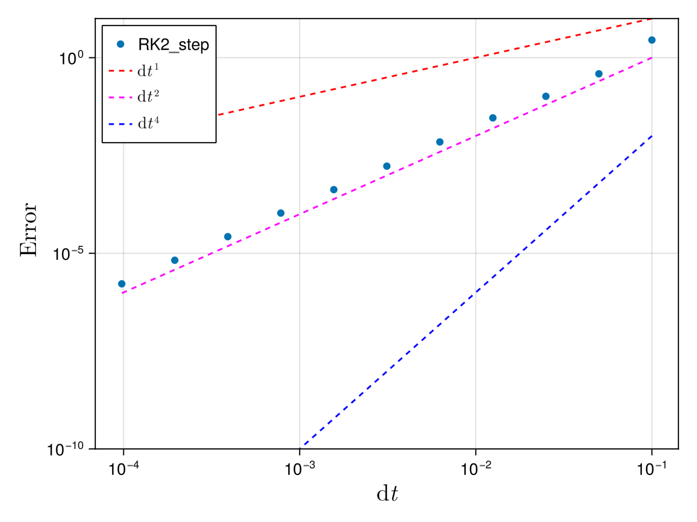

## TestTimeStepping solver

### Description

System used to check [Time-stepping](@ref "Time-stepping") methods accuracy. In this case, the collision integral is

$$St_{\bf k} = n_{\bf k}^2$$

so the kinetic equation has non trivial, but analytical solutions.

### Solver

There is no coupling between different modes, so the implementation of the solver is straigthforward.

### Diagnostics

The standard diagnostics should work for this system.

### Theoretical predictions

The analytical solution for the wave action is 

$$n_{\bf k}(t) = \frac{1}{2} \left( d_{\bf k} + c_{\bf k} \tan \left( \arctan \left( \frac{-d_{\bf k} + 2 n_{\bf k}(0)}{c_{\bf k}} \right) + \frac{c_{\bf k} t}{2} \right) \right)$$

where $c_{\bf k} = \sqrt{4 f_{\bf k} - d_{\bf k}^2 }$. The numerical prediction is compared to the analytical solution for different time-stepping methods in the `run/tests/tests_time_stepping.jl` script. It allows to check that the Runge-Kutta 2 [`RK2_step`](@ref "RK2_step") method is of order $2$ accurary with the time step ``\mathrm{d}t``, as shown on the following figure



The other methods (e.g. [`Euler_step`](@ref "Euler_step") or [`RK4_step`](@ref "RK4_step")) can be tested as well.


### List of structures and methods for TestTimeStepping solver
```@autodocs
Modules = [WavKinS]
Order   = [:type, :function]
Pages   = ["src/physical_systems/TestTimeStepping/basics.jl", "src/physical_systems/TestTimeStepping/structure.jl", "src/physical_systems/TestTimeStepping/collision_integral.jl"]
```
