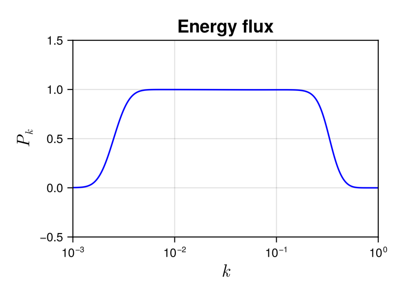
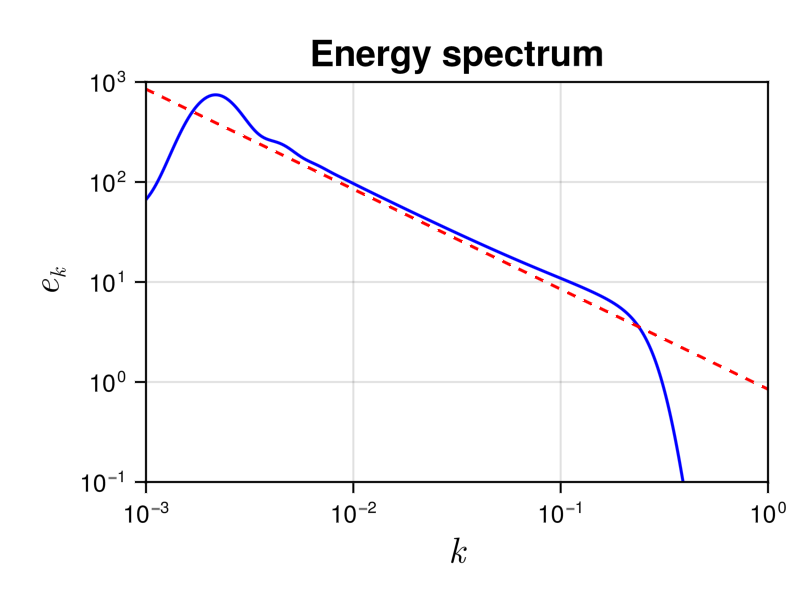

# A simple tutorial to start 

In this section, we explain how WavKinS works with a concrete example. To this end, we will use the solver for 2D acoustic waves. Here we explain how to launch a simple simulation to test the direct energy cascade prediction, characterized by constant energy flux to small scales and the steady energy spectrum

```math
    e_k = 2\pi k \omega_k n_{\bf k} = \frac{4^{3/2} \sqrt{a c}}{3 \pi} ~ k^{-1}.    
```

To this end, we use the script `run/simple/RunSimpleEvolution_Acoustic.jl`. For more informations about the solver, you can look at this [section](@ref "Acoustic2D solver").


!!! info
    The solver is defined in `src/physical_systems/Acoustic` folder:
    * The `basics.jl` file contains the dispersion relation `ω_Acoustic` and squared interaction coefficient appearing in the collision integral `S_2DAcoustic`. We also usually need methods to parameterize the resonant manifold, etc.
    * The `structure.jl` file contains the structure containing all necessary variables and methods for a [`Acoustic2D`](@ref) simulation (grid, waveaction spectrum, collision integral, time, etc).
    * The `collision_integral.jl` file contains the function [`function St_k!(Run::Acoustic2D)`] which compute the collision integral ``St_{\bf k}``. For all solvers, the collision integral is [`function St_k!(Run::StructureType)`] where `StructureType` is the structure of the simulation. 


 
## Run simple evolution

In this section, we explain the different part of the `run/simple/RunSimpleEvolution_Acoustic.jl` script. 

### Includes

The first part of the script 

```julia
push!(LOAD_PATH, "../")
using WavKinS
using GLMakie;
GLMakie.activate!();
using TimerOutputs
```

is to import modules. Here, we need WavKinS, GLMakie for plots, and TimerOutputs to test performances. 

!!! note
    The module GLMakie does not work on some systems (clusters).

The lines

```julia
if Threads.nthreads() == 1
    @warn "Set the number of threads by doing export JULIA_NUM_THREADS "
end
```

warns you in case you use only $1$ thread.

!!! note
    WavKinS is parallelized so you can use several threads on most modern computers, speeding up simulations. For example, to run the script with 8 threads, go to `run/simple` folder and run:

    ```
    julia --project --threads 8 RunSimpleEvolution_Acoustic.jl
    ```

```julia
const to = TimerOutput()
```

defines the timer for outputs to check the code's performance.


### The time loop

To do the time advancement and manage the outputs and plots, we define the following function 

```julia
function run_simple_evol(Run, Param, Tfinal)
```

that take the Run, the simulation parameters, and the final time of the simulation as arguments. In the following lines

```julia
    step_scheeme = Run.time_stepping
    init_temporal_scheeme!(step_scheeme, Run, Param.dt)
    tini = Run.t
    tplotEvol = tini
    tglobalEvol = tini
    tsptoreEvol = tini
    tspwriteEvol = tini
    t = tini
```

we define a shortcut for the time-stepping method and initialize time-stepping and time variables.

The constants of the theoretical prediction for the energy spectrum are defined here

```julia
    V0GP = 3 * sqrt(Run.c / 2.0) / 4.0

    if Run.name == "Acoustic2D"
        Cd = 4^(1 / 4) * sqrt(Run.c) / (pi * V0GP)
        Prefactor = Cd * sqrt(Run.a * Run.c)
        xP = 1
        iP = findfirst(x -> x >= 5e-2, Run.Nk.kk)
    elseif Run.name == "Acoustic3D"
        Prefactor = sqrt(3 * Run.c / (32 * V0GP^2 * π * (π + 4 * log(2) - 1.0)))
        xP = 3 / 2
        iP = findfirst(x -> x >= 5e-2, Run.Nk.kk)
    else
        Prefactor = 1.0
        xP = 0.0
    end
```

Note that we also have implemented the 3D acoustic wave case. These constants are used to plot the theoretical prediction.

We start the time loop and stop it if we detect NaNs in the spectrum:

```julia
    @time while t < tini + Tfinal
        if any(isnan.(Run.Nk.nk))
            @warn "We got NaNs. Stop the temporal loop"
            break
        end
```

The following lines advance the simulation by one time step.

```julia
        @timeit to "Advance" advance!(step_scheeme, Run, Param.dt)
        t = Run.t
```

!!! info
    The macro 
    ```julia 
    @timeit 
    ```
    is used to measure computational time of the [`advance!`](@ref) method.


The remaining of the function is for writing and storing outputs, and plotting:

```julia
        @timeit to "Global quantities" if t >= tglobalEvol
            get_global_diagnostics!(Run)
            if Param.write_global
                output_global(Run, Param.outputDir)
            end
            Energy = Run.diags.glob_diag["H"].out[end]
            WaveAction = Run.diags.glob_diag["N"].out[end]
            println("t =", Run.t, "   H(t) =", Energy, "     N(t) = ", WaveAction)
            tglobalEvol += Param.tglobal
        end

        @timeit to "Storing spectral quantities" if t >= tsptoreEvol
            store_spectral!(Run)
            tsptoreEvol += Param.tspstore
        end

        @timeit to "Writing spectral quantities" if t >= tspwriteEvol
            if Param.write_spectral
                compute_spectral!(Run)
                output_spectra(Run, Param.outputDir)
            end
            tspwriteEvol += Param.tspwrite
        end

        @timeit to "Plotting" if t >= tplotEvol
            P0 = Run.diags.sp_outs["Pk"].sp[iP]
            plot_energy!(Run; fig=figE, ax=axE)
            plot_theo!(axE, kk, Prefactor * sqrt(abs(P0)) * kk .^ (-xP))
            plot_energy_flux!(Run; fig=figP, ax=axP)
            sleep(0.0001)
            tplotEvol += Param.tplot
        end

    end
end
```


### Physical system, numerical scheemes, and simulation parameters

We first define the wave action structure as follows

```julia
M = 1024
kmin = 1e-3
kmax = 1e0
Nk = wave_spectrum(kmin, kmax, M)
```

where `M` is the resolution and `kmin` and `kmax` are the minimal and maximal wave vectors. Then we construct the run structure:

```julia
Run = Acoustic2D(Nk; a=1.0, interp_scheeme=WavKinS.lin_interp, time_stepping_scheeme=WavKinS.RK2_step)
kk = Nk.kk
λ = Nk.λ
```
Here, we have fixed the disperion length `a=1.0`, the interpolation method `lin_interp` and the time stepping metho `RK2_step`. We also make shortcuts for the wave vector grid `kk` and the logarithmic increment `λ`.

We define parameters of the forcing and dissipation, namely the dissipation wavevector `kd`, the power of the Laplacian operator used for dissipation `lapPower`, the middle wave vector of the forcing region `kf`, and the forcing width `Δkf`.

```julia
kd = 0.25 * kmax
lapPower = 4
kf = 2 * kmin
Δkf = (log(kmax) - log(kmin)) / 25
```

We then define a localized forcing with log normal shape, and the dissipation coefficient

```math
    f_k \propto \exp \left[ - \frac{1}{2} \left( 25 \frac{\log k - \log k_{\rm f}}{\log k_{\rm max} - \log k_{\rm min}} \right)^2 \right], \quad d_k = \left( \frac{k}{k_{\rm d}} \right)^8
```

with the following lines

```julia
@. Run.Nk.nk = exp(-0.5 * ((log(kk) - log(kf)) / Δkf)^2);
EE = energy(Run)
@. Run.FD.f = Run.Nk.nk / EE
@. Run.FD.D = (kk / kd)^(2 * lapPower)
```

Note that the forcing is normalized such that the energy injection rate, computed numerically, is equal to one. The final time and the time step are

```julia
Tfinal = 10.0; # Final time of the simulation
dt = 0.0025 # time step of the simulation
```


### Outputs

We use the boolean

```julia
isrestart = false # set this to true if simulations uses a restart
```

to start a new simulation, or to restart from the end state of an old simulation.

You can define the parameters for storing different outputs and the frequency for plots.

```julia
tplot = 0.1; # Plot every tplot times
tglobal = 0.1; # Compute, store and write global quantities every tglobal times 
tspstore = 20000 # Compute and store spectral quantities every tspstore times
tspwrite = 0.1 # write spectra every tspwrite

outputDir = "./" #output directory
write_global = true #write global
write_nk = true #write wave action
write_Ek = true #write energy spectrum
write_Pk = true #write energy flux   
```

We create a simulations parameters container as follows

```julia
write_spectral = write_nk || write_Ek || write_Pk
Param = simulation_parameters(dt, tplot, tglobal, tspstore, tspwrite,
    outputDir, write_global, write_spectral)

Run.diags.sp_outs["nk"].write_sp = write_nk
Run.diags.sp_outs["Ek"].write_sp = write_Ek
Run.diags.sp_outs["Pk"].write_sp = write_Pk 
```

If `isrestart=false`, initialize the outputs. Otherwise, we load the spectrum in the simulation file to restart:

```julia
if ~isrestart
    get_global_diagnostics!(Run)
    init_IO(Run, Param.outputDir)
    if Param.write_global
        output_global(Run, Param.outputDir)
    end
    if Param.write_spectral
        compute_spectral!(Run)
        output_spectra(Run, Param.outputDir)
    end
else
    load_spectrum(Run, Param.outputDir)
    get_global_diagnostics!(Run)
    compute_spectral!(Run)
end
```

Before running the simulation, we compute and print initial wave action and energy:

```julia
println("Run in resolultion M=", M, " with λ=", Run.Nk.λ)
println("Total wave action =", Run.diags.glob_diag["N"].out[end])
println("Total energy =", Run.diags.glob_diag["H"].out[end])
```


### Simple plots and start the simulation

You can plot the energy spectrum or the energy flux by adapting this part of the script:

```julia
figE, axE = plot_energy!(Run; ylims=(1e-1, 1e+3))
figP, axP = plot_energy_flux!(Run, ylims=(-0.5, 1.5))
display(figP) # figE (figP) if you want to plot energy spectrum (energy flux)
```

We run the simulation by calling the time loop function as follows

```julia
run_simple_evol(Run, Param, 0.0) # Good to run first to measure time properly
reset_timer!(to)

run_simple_evol(Run, Param, Tfinal)
```

You can save energy spectrum and energy flux plots at the end of simulation with

```julia
save("tutorial_energy.png", figE)
save("tutorial_flux.png", figP)
```

The outputs are saved in `WKE_Acoustic2D_data.nc`. 


### Analysis 

Running the script should display the temporal evolution of the energy spectrum or the energy flux. At the end of the simulation the energy flux look like this 



We see a plateau in the inertial range `kf` $< k <$ `kd`, whose height is equal to the energy injection rate, which is one.  It corresponds to a constant energy flux to small scale. In the dissipative range $k >$ `kd`, the energy flux tends to zero, meaning that the collision integral conserves the energy.

We show the energy spectrum in the following figure



It allows to compare it to the theoretical prediction $e(k) = \frac{4^{3/2} \sqrt{ac} }{3\pi} k^{-1}$, shown with a dashed line. We see a good agreement in the inertial range.


## Performances

At the end of the simulation, you can look at the perfomances of the code by using

```julia
println(to)
```

which displays a detailed statistical analysis of time and memory usages of the different functions:

```
 34.288965 seconds (913.48 k allocations: 105.154 MiB, 0.04% gc time)
────────────────────────────────────────────────────────────────────────────────────────
                                               Time                    Allocations      
                                      ───────────────────────   ────────────────────────
          Tot / % measured:                34.3s /  99.9%            105MiB /  83.6%    

Section                       ncalls     time    %tot     avg     alloc    %tot      avg
────────────────────────────────────────────────────────────────────────────────────────
Advance                        4.00k    33.3s   97.3%  8.33ms   48.1MiB   54.7%  12.3KiB
Plotting                       4.00k    378ms    1.1%  94.6μs   32.6MiB   37.1%  8.35KiB
Global quantities              4.00k    297ms    0.9%  74.3μs   1.78MiB    2.0%     466B
Writing spectral quantities    4.00k    261ms    0.8%  65.3μs   5.42MiB    6.2%  1.39KiB
Storing spectral quantities    4.00k   2.16ms    0.0%   541ns   24.5KiB    0.0%    6.27B
────────────────────────────────────────────────────────────────────────────────────────
```

We see that the simulation was completed in $\simeq 34.3$ s and has used $\simeq 105$ MiB of memory.

!!! note
    TimerOutputs is very useful to find perfomances issues in julia's codes.